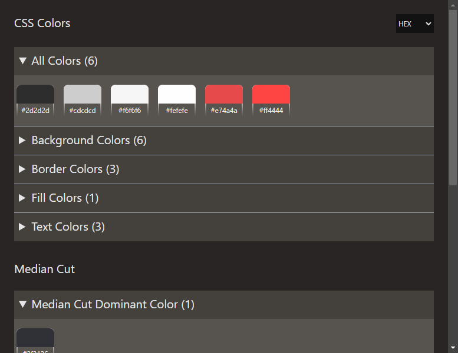

# HueHarvester 



HueHarvester is a Google Chrome extension that creates color palettes from webpages using CSS and image analysis. Including detection of dominant color.

Click the extension's icon in your browser bar to begin the generation of the color palettes. Click individual colors to copy their value.

Select from different color spaces to present colors in your preferred format (RGB, HSL, Hex, etc)

**🚧WORK IN PROGRESS, PARDON OUR MESS🏗️**

## Development
This library uses CRXJS to hot reload the extension during development. You'll need to enable developer mode in Chrome and load the unpacked `/dist` folder.

Start the development server using Vite:
```bash
pnpm dev
```

### Installation
Install the dependencies using PNPM, the package.json enforces the Node and PNPM versions:
```bash
pnpm install
```

## Directory Structure
Synopsis of key directories and files in the project:
- `dist/` - Contains the built extension script files produced by Vite/Rollup
- `public/` - Contains static files that are copied to the `dist` directory
  - `manifest.json` - Chrome extension configuration file
- `src/` - Source files
  - `components/` - Reusable React components
  - `lib/` - Library/helper functions
    - `colors.ts` - Functions for extracting colors from images and CSS and processing them
    - `imaging.ts` - Function for capturing the current webpage as an image
  - `App.tsx` - Main React component
  - `main.tsx` - Entry point for the React application that is loaded in the extension's popup window
- `eslintrc.cjs` - ESLint configuration file
- `index.html` - HTML template for the extension's popup window that loads in the React application
- `vite.config.ts` - Vite configuration file, CRXJS is configured here


## Key Technologies
- [JavaScript](https://developer.mozilla.org/en-US/docs/Web/JavaScript) (Programming Language)
- [TypeScript](https://www.typescriptlang.org/) (Type-Safe Superset of JavaScript)
- [Vite](https://vitejs.dev/) (Development Server)
- [React](https://reactjs.org/) (UI Library)
- [Tailwind CSS](https://tailwindcss.com/) (Utility-First CSS Framework)
- [ESLint](https://eslint.org/) (Code Linter)
- [Chrome Extension API](https://developer.chrome.com/docs/extensions/reference/) (Extension Development)
- [PNPM](https://pnpm.io/) (Package Management)
- [Rollup](https://rollupjs.org/) (Bundling)
- [Color Thief](https://github.com/lokesh/color-thief) (Median Cut Algorithm)
- [CRXJS](https://crxjs.dev/vite-plugin) (Vite Plugin for Hot-Reloading Chrome Extensions)

## Inspired By
- [Extract Colors DevTool](https://github.com/guiexperttable/extract-colors-chrome-extension)
- [Site Palette](https://palette.site/)
- [ColorZilla](https://www.colorzilla.com/chrome/)

## License
This project is licensed under the MIT License - see the [LICENSE](LICENSE) file for details.

## Contributions
Contributions are welcome! You are welcome to open an issue, create a pull request, fork the project, or reach out to the maintainers.